[TOC]

# 1.数据集

超过45,000部电影的元数据。来自270,000多名用户的2600万评级。

数据来源：https://www.datafountain.cn/datasets/65

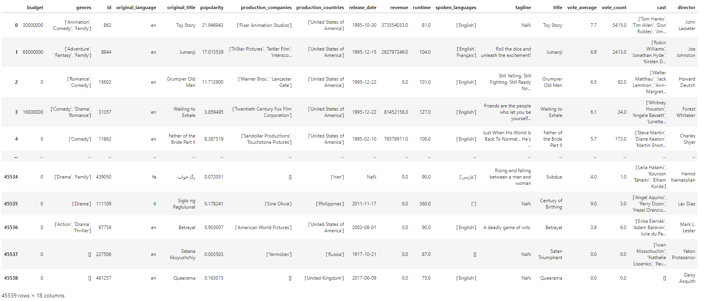

<b>经过预处理后的数据

# 2.代码运行方式

SpringBoot项目test文件夹下，运行DroolsApplicationTests下的函数。

# 3.初始评分

初始评分采用贝叶斯统计的算法得出的加权分(Weighted Rank-WR)

-R ：该电影的算数平均分   （取6.7663077745284665）

-v ：该电影投票数

-m：进入imdb top 100需要的最小投票数   （取300）

-C ：目前所有电影的平均票数

# 4.可视化引擎

通过workbench可视化规则。

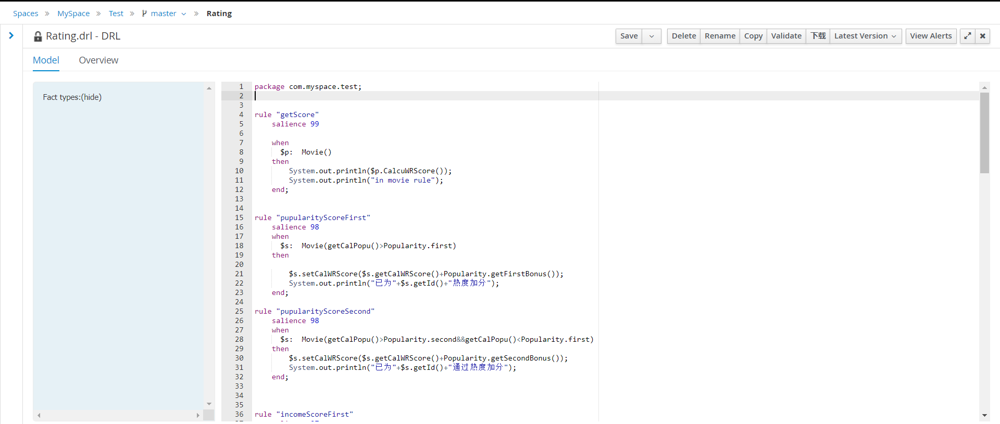

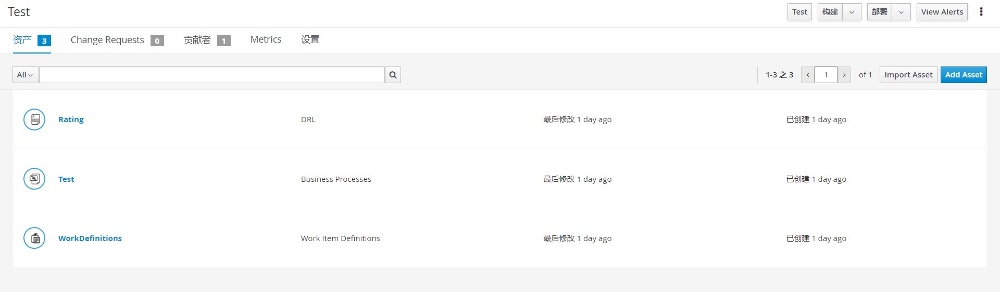

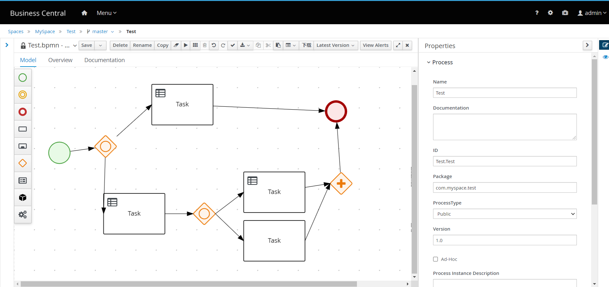

# 5.推荐计分规则

在得出各电影的初始评分后，额外考虑推荐加分方式，两种计分方式总分都为10分，各占比50%。

最终计算出推荐总分，排序筛选出前100部电影进行推荐。

对比此前采用在初始评分的基础上进行小数位加分制，各占比50%更倾向于推荐近期的高分电影，效果更好。

<b>基础评分加分制

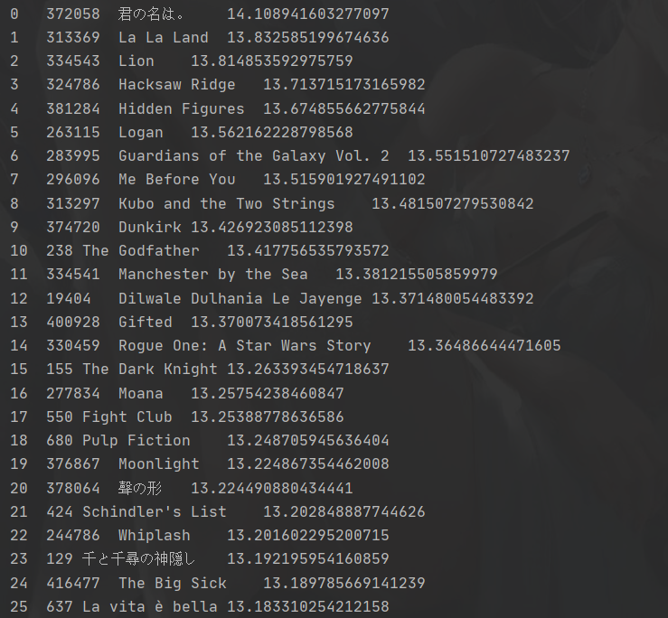

<b>基础评分与推荐评分5:5

## 1.票房和预算差值minus

根据revenue和budget的差值(不考虑数据集中为0的无效数据)，等频分箱为6份，再根据分箱情况取大于零的数据集设定加分标准。

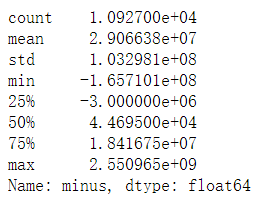

<b>minus数据分布

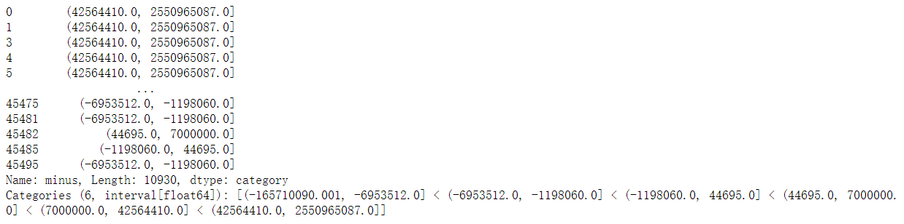

<b>minus分箱具体情况

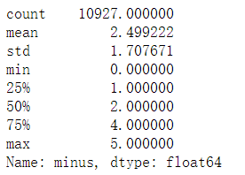

<b>minus分箱后的数据分布

**最终加分标准**

| Condition       | Score |
| --------------- | ----- |
| minus\>44695    | +1    |
| minus\>7000000  | +2    |
| minus\>42564410 | +5    |

## 2.受欢迎程度popularity

根据受欢迎程度popularity，等频分箱为5份，再根据分箱情况设定加分标准。

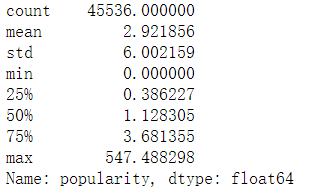

<b>popularity数据分布</b>

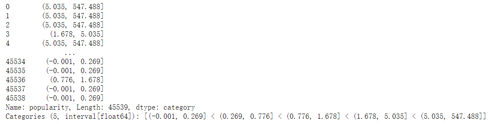

<b>popularity分箱具体情况

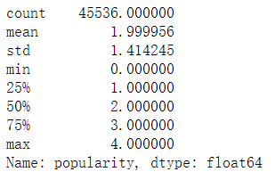

<b>popularity分箱后的数据分布

**最终加分标准**

| Condition        | Score |
| ---------------- | ----- |
| popularity>1.678 | +1    |
| popularity>5.035 | +2    |

## 3.距今年数

根据发布日期release_date计算电影发布距今年数date_minus，优先推荐近期电影。根据数据分布情况可以看到66%以上的电影年份都超过了12年，考虑到推荐的时效性，选择1，2，5年为标准。

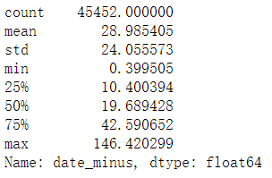

<b>date_minus数据分布

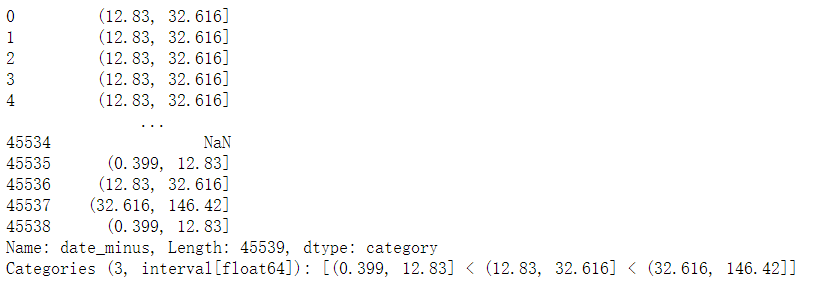

<b>date_minus具体分箱情况

**最终加分标准**

| Condition    | Score |
| ------------ | ----- |
| data_minus<1 | +3    |
| data_minus<2 | +2    |
| data_minus<5 | +1    |

# 6.动态推荐

在用户输入后通过输入变量在规则中进行筛选，在原来推荐基础上根据用户喜好重新推荐。

## 1.喜欢的国家

在推荐规则的基础上，根据用户输入原生语言类型进行动态推荐。

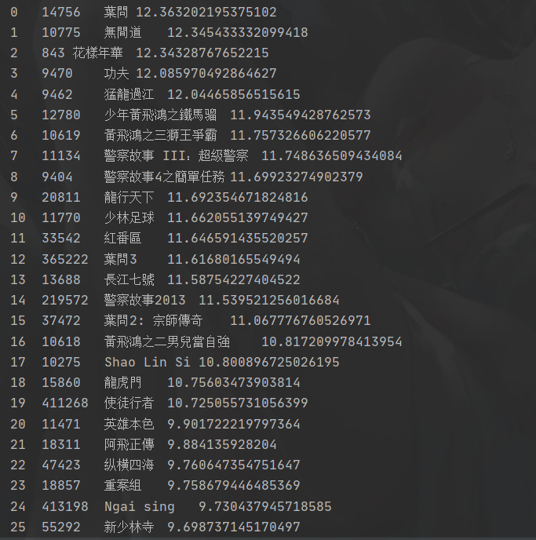

<b>推荐的中国电影

## 2.喜欢的类型（暂未实现）

在推荐规则的基础上，根据用户输入类型进行动态推荐。

## 3.喜欢的导演director（暂未实现）

在推荐规则的基础上，根据用户输入喜欢的导演进行动态推荐。

## 4.喜欢的演员（暂未实现）

在推荐规则的基础上，根据用户输入喜欢的演员进行动态推荐。

# 7.OptaPlanner

详情见代码。

